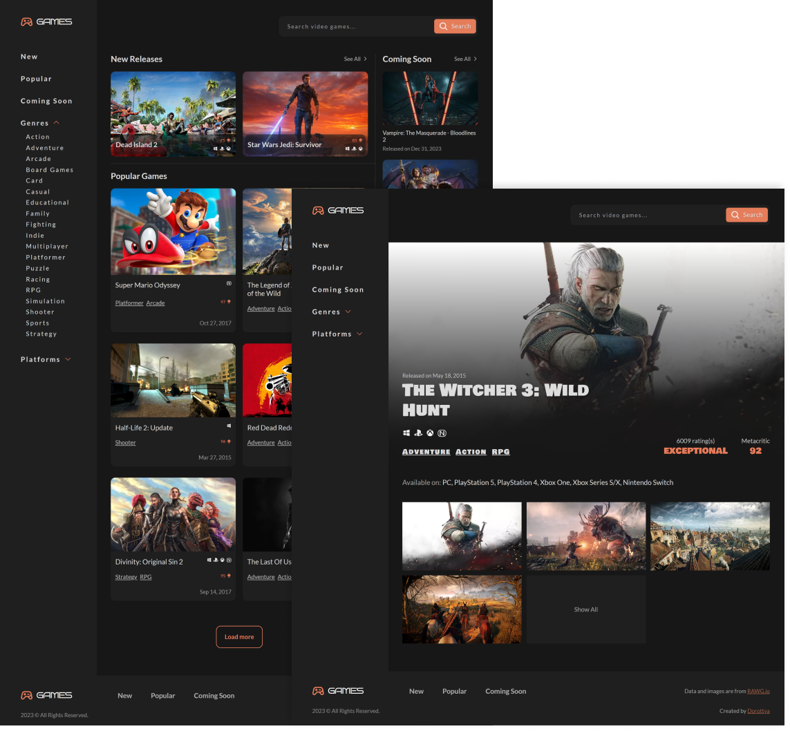

# Video Games API site

Users are able to:

- See lists of new, popular and upcoming video games
- Search for video games by name
- Filter video games by genre and platform
- See details of a video game
- View the optimal layout for the app depending on their device's screen size
- See hover states for all interactive elements on the page

### Built with

- React
- React Router
- Axios
- CSS custom properties
- Flexbox
- CSS Grid
- Mobile-first workflow
- [Rawg API](https://rawg.io/apidocs)

### Link

[games-dorottya-b.vercel.app](https://games-dorottya-b.vercel.app/)

### Screenshots

## Author

Designed and coded by [Dorottya](https://github.com/DorottyaB)
